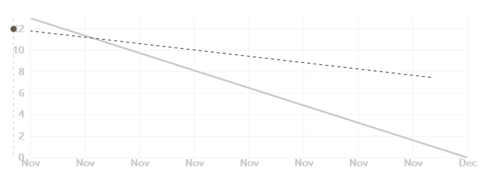

# 对联小组
[燃尽图url](http://radekstepan.com/burnchart/#!/)

## 任务更改：
姚青松、赵瑞静：tags 2 couplet  
张一卓、刘泽：image 2 tags  
徐宇飞、张持：server、app、web  
齐炜祯：PM + 哪边缺人手去哪边  

燃尽图任务alpha阶段前一半（前五天）：  
第一天：把之前调研阶段找好的轮子拼在一起，完整串联跑起来并且分析。全组每人4h/天。结束后休息备战后面的任务。  
第二天：tags2images组尝试将古诗的训练信息和constraint改成对联的平仄constraint和对联语料进行训练。4h进行尝试修改。images2tags组尝试寻找人脸识别的论文和代码库。要求完成可以分析提取出人脸的表情、五官的特点和尽可能多的信息。相信有不少人脸的处理文献可以参考，尽可能找最多信息的。4h阅读论文和查找代码。Web组学习websocket的内容并且整理tags2couplet组以及images2tags组之前的代码，串联在一起并且整理好。4h。PM查找人脸描写的古诗数据、调研人脸分析的app市场和处理水平，确定人脸处理的可行性。4h

第三天：tags2couplets组对第一天修改的经验进行总结，在此基础上继续修改和debug，要求在这一天的4h内train上couplet的数据。有剩余时间和PM沟通协商人脸作诗的技术细节和可行性。Images2tags组完成论文的阅读和代码的搜寻，开始阅读代码并尝试初步修改。有剩余时间则修改完全，训上或者跑通。Web组任务重，人手少，PM和web组一起进行网页的搭建和优化4h。

第四天：tags2couplets组无论训到哪一步，都给一个可以跑的权重和代码给web组。Web组和PM对couplets的生成模型以及现有web代码进行测试拼接和整理。Images2tags组整理完成其任务，若有时间，到web组来一起写网页。Tags2couplets组如果有剩余时间，和PM一起进行人脸作诗的代码构建。

第五天：web组和images2tags组对软件进行测试。对串起来的对联和古诗生成功能进行优化，网页的构建和修改。PM和tags2couplets组对人脸作诗的代码进行书写和修改，尽可能在这天完成的时候可以train上。

## 每组请提一个issue，每天更新进度以及后续目标和预计时间。  
1.	Program Manager：齐炜祯；负责所有杂活
2.	从图片感知->tag 刘泽和一卓
3.	Tag->第一句话 青松和瑞静
4.	第一句话到后面几句话  齐炜祯 宇飞
5.	服务器搭建，网页搭建，微信小程序/app 宇飞 早早
## 合作方式：
不要拉branch。每组一个文件夹，随时更新进度。  
有沟通需求请提issue。每天请查看其他组issue进度。  
paper文件夹放置有需要其他组也一起读读的论文。  

## 前五天：（11.26-11.30）第一环节：MVP
1.	感知服务->结果：苹果，巴黎铁塔；而训练语料古诗，对联去训练一个seq2seq。苹果和巴黎铁塔不在后续训练集中。
2.	上传的表情包或无法识别的东西
**第一阶段忽略以上所有问题**  
  
  
周三全组meeting更新进度。务必确保在周五前完成MVP，最好周三晚or周四晚就可以2，3，4串在一起跑起来。每小组内部每天内部  meeting，确定进度和目标。  
**周三全组会议后的周四周五解决第一阶段忽略的问题和新产生的问题。能解决多少解决多少，如音律，押韵，平仄，对仗等问题，实在解决不完的放在第二阶段。底线是周五要MVP顺利跑起来**
## 后五天（11.26-11.30）第二阶段：总结前五天的进度，经验，教训；确定工作量；后续功能能加多少加多少，剩下的beta版本继续做。  
后续新的寻求在进行coding的过程中总结体会，都列在下面；适当时间开会讨论加哪些功能。  
**设定是出对联还是古诗，五言还是七言等等。**  
**尝试能否提取位置、环境等信息**  
**能否创作中选择画风，如搞笑；悲伤；潇洒等**  
**其他用户反馈**  
**优化分享朋友圈做法**……

